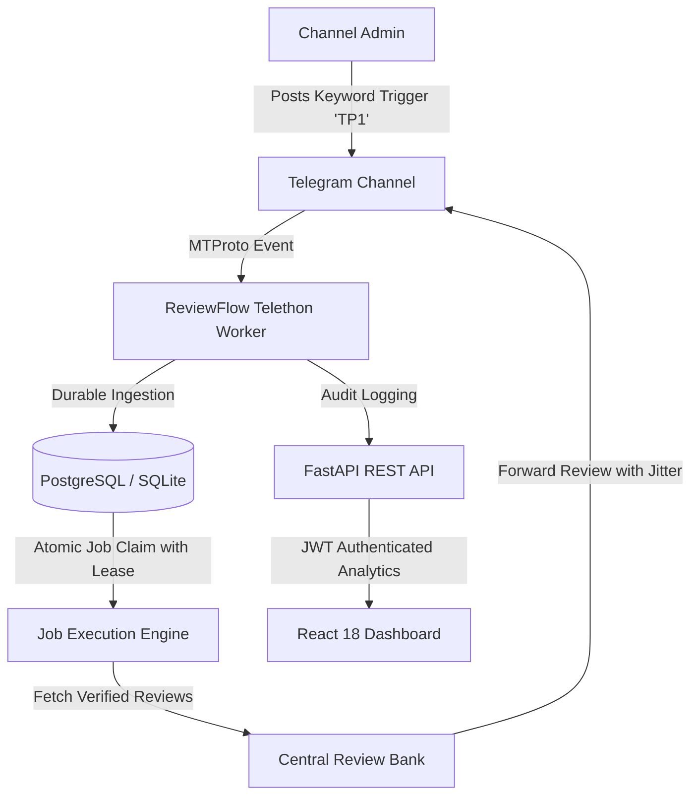

# 🚀 ReviewFlow SaaS Platform
### *Telegram Automation & Review Distribution System for Trading Communities*

[](https://fastapi.tiangolo.com)
[](https://reactjs.org)
[](https://telethon.readthedocs.io)
[](https://tailwindcss.com)
[](https://opensource.org/licenses/MIT)
[](https://www.python.org/)

---

## 🌟 Overview

**ReviewFlow** is a multi-tenant SaaS workflow automation platform engineered for **Telegram Channel Administrators and Community Managers**.

When an administrator or authorized signal provider posts a defined trigger keyword (e.g. `TP1`, `TP2`, `الهدف الأول`, or custom terms) in a connected channel, **ReviewFlow ingests the trigger durably into a persistent database queue, applies configurable start delays and randomized human timing jitter, and forwards pre-approved reviews from a central verified review library into the channel**.

---

## 💡 Key Features

- **⚡ Realtime Trigger Interception**: MTProto listener and channel poller detecting configured keyword events.
- **🛡️ Multi-Tenant Architecture**: Tenant-scoped database models and row-level authorization preventing cross-tenant data leakage.
- **⏱️ Configurable Initial Start Delay (تأخير بدء الإرسال)**: Customize the exact warm-up delay before the first review is forwarded.
- **🎲 Human Timing Jitter**: Configurable randomized micro-delays between subsequent review deliveries to pace message distribution.
- **🧙‍♂️ 3-Step Channel Onboarding Wizard**: Guides channel owners through adding the bot and verifying administrator publishing rights.
- **📊 Real-Time SaaS Dashboard**:
  - Channel Management & Permissions Verification.
  - Automation & Strategy Manager with instant test-run triggers.
  - Live Audit Logs & Real-Time Publishing History.
  - Subscription Plan Quota Enforcement (Starter, Pro, VIP).
- **🔒 Concurrency & Crash Recovery**: Atomic job claiming (`SELECT FOR UPDATE SKIP LOCKED` / immediate transactional locking) and lease-based heartbeat crash recovery.

---

## 🏗️ Architecture



---

## 🚀 Production Deployment (Docker Compose)

### 1. Prerequisites
- Docker Engine 24+ & Docker Compose v2+
- Telegram API ID & API Hash (from [my.telegram.org](https://my.telegram.org))

### 2. Clone and Configure
```bash
git clone https://github.com/yossefbelal1/MassgesReview.git
cd MassgesReview
cp .env.example .env
```

Edit `.env` and set your production secrets:
```ini
ENVIRONMENT=production
SECRET_KEY=generate_a_random_32_character_hex_key
POSTGRES_USER=reviewflow
POSTGRES_PASSWORD=your_strong_database_password
POSTGRES_DB=reviewflow_db
TELEGRAM_API_ID=your_api_id
TELEGRAM_API_HASH=your_api_hash
TELEGRAM_STRING_SESSION=your_string_session
CORS_ORIGINS=https://app.yourdomain.com
```

### 3. Run Database Migrations
```bash
docker compose run --rm api alembic upgrade head
```

### 4. Start Platform
```bash
docker compose up -d --build
```

### 5. Verify Health Probes
```bash
curl http://localhost:8000/api/v1/health/ready
```

---

## 📡 API Endpoints Summary

| Method | Endpoint | Description |
| :--- | :--- | :--- |
| `POST` | `/api/v1/auth/register` | Customer account registration |
| `POST` | `/api/v1/auth/login` | OAuth2 Bearer token authentication |
| `GET` | `/api/v1/health/ready` | Dynamic dependency readiness check |
| `GET` | `/api/v1/channels/` | List connected channels for tenant |
| `POST` | `/api/v1/channels/join` | Step 1: Auto-join channel via link |
| `POST` | `/api/v1/channels/verify` | Step 2: Verify admin rights & link channel |
| `GET` | `/api/v1/automations/` | List keyword automations |
| `POST` | `/api/v1/automations/` | Create keyword trigger with timing parameters |
| `POST` | `/api/v1/automations/{id}/run-now` | Test-run review sequence |
| `GET` | `/api/v1/history/` | Live publishing audit trail |

---

## 🔒 Security & Compliance Policy

- **Multi-Tenancy**: All channel, automation, and history endpoints are strictly scoped to the authenticated tenant.
- **Rate Limiting**: Critical endpoints (auth, channel joining, and manual triggers) are protected against abuse.
- **Telegram Policy Notice**: Automated messaging must comply with Telegram's Terms of Service and rate limits. ReviewFlow includes built-in FloodWait backoff to prevent rapid request bursts. Channel administrators are responsible for ensuring that all forwarded reviews represent authentic user feedback.

---

## 📄 License

This project is licensed under the MIT License - see the [LICENSE](LICENSE) file for details.
