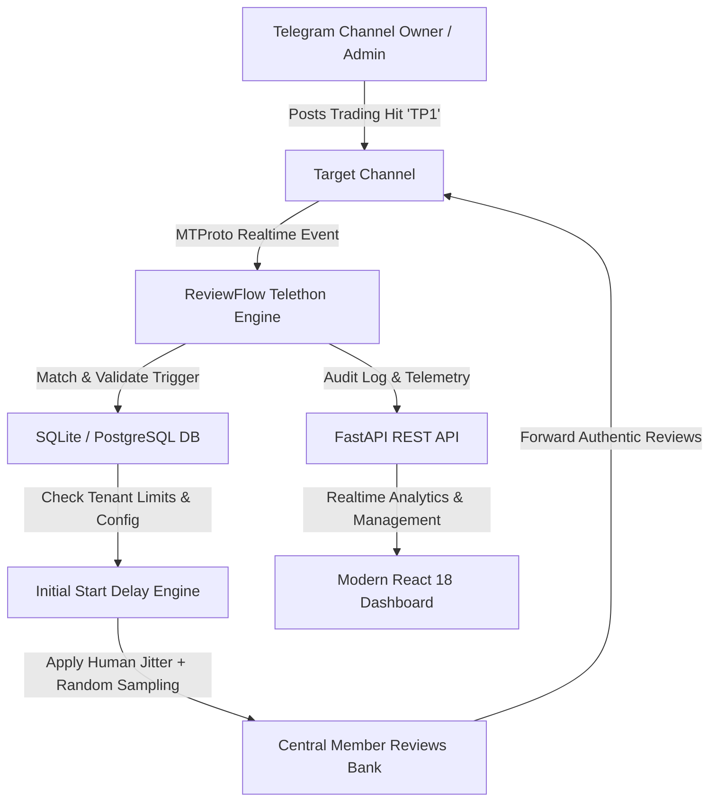

# 🚀 ReviewFlow SaaS Platform
### *Enterprise Telegram Automation & Live Review Forwarding System for Forex & Trading Channels*

[](https://fastapi.tiangolo.com)
[](https://reactjs.org)
[](https://telethon.readthedocs.io)
[](https://tailwindcss.com)
[](https://opensource.org/licenses/MIT)
[](https://www.python.org/)

---

## 🌟 Overview

**ReviewFlow** is a modern, high-performance SaaS automation platform engineered specifically for **Forex, Crypto, and Financial Telegram Channel Owners**.

When a trader posts a signal hit (e.g. `TP1`, `TP2`, `الهدف الأول`, or custom keywords) in their channel, **ReviewFlow instantly intercepts the trigger, applies human-like timing jitter and initial start delays, and forwards authentic individual client feedback reviews from a central verified review repository into the channel automatically 24/7**.

---

## 💡 Key Enterprise Features

- **⚡ Instant Realtime Trigger Interception**: High-speed, dual-layer MTProto listener & watcher engine detects keywords and trading signal updates in sub-second response time.
- **🛡️ 100% Channel Isolation**: Multi-tenant database cursors guarantee that triggers in one channel never leak or post into another channel.
- **⏱️ Configurable Initial Start Delay (تأخير بدء الإرسال)**: Customize the exact warm-up delay (e.g. 5s, 10s, 30s) before the first review arrives.
- **🎲 Human Timing Jitter (±1.5s)**: Eliminates robotic patterns with randomized micro-delays between subsequent review deliveries.
- **🧙‍♂️ 3-Step Onboarding Wizard for Large Channels (>200 Subscribers)**: Seamlessly bypasses Telegram's member addition limits by allowing the bot to auto-join public/private links before admin promotion.
- **🔒 Authentic Member Headers**: Strict filtering rejects any internal channel forward tags, ensuring 100% of reviews display authentic individual trader names.
- **📊 Interactive SaaS Dashboard**:
  - Multi-Channel Management & Health Verification.
  - Custom Strategy & Keyword Manager with instant test-run triggers.
  - Live Audit Logs & Real-Time Publishing History.
  - Tiered Subscription Plans (Free, Starter, Pro, Enterprise).
- **🛡️ Self-Healing Process Supervisor (`start_all.py`)**: Monitors the FastAPI backend, React dashboard, and Telegram daemon with auto-recovery.

---

## 🏗️ Architecture Overview



---

## 📂 Project Structure

```
MassgesReview/
├── backend/
│   └── app/
│       ├── api/               # REST API Routes (Auth, Channels, Automations, Jobs, History)
│       ├── core/              # Config, Database Connection, Security & JWT
│       ├── models/            # SQLAlchemy Models (Tenant, User, Channel, Automation, Plan)
│       ├── schemas/           # Pydantic Validation & Serialization Schemas
│       └── services/          # Telegram MTProto Service & Worker Logic
├── frontend/
│   ├── src/
│   │   ├── api/               # Axios Client with JWT interceptors
│   │   ├── components/        # Sidebar, Header, Modal dialogs, Stepper bars
│   │   ├── pages/             # Dashboard, Channels Wizard, Automations, History
│   │   └── context/           # AuthContext & State management
│   ├── package.json
│   ├── tailwind.config.js
│   └── vite.config.js
├── telegram_engine/
│   └── listener.py            # High-performance MTProto Listener & Watcher Engine
├── reviewflow.db              # SQLite Database (Production ready)
├── start_all.py               # Self-healing Master Supervisor
├── requirements.txt           # Python Dependencies
├── .env.example               # Environment Variables Template
└── README.md                  # Project Documentation
```

---

## 🚀 Quick Start & Installation

### 1. Prerequisites
- **Python 3.10+**
- **Node.js 18+ & npm**
- **Telegram API ID & API Hash** (from [my.telegram.org](https://my.telegram.org))

### 2. Clone the Repository
```bash
git clone https://github.com/yossefbelal1/MassgesReview.git
cd MassgesReview
```

### 3. Backend Setup
```bash
# Create and activate virtual environment
python -m venv venv
# On Windows:
venv\Scripts\activate
# On Linux/macOS:
source venv/bin/activate

# Install Python dependencies
pip install -r requirements.txt
```

### 4. Frontend Setup
```bash
cd frontend
npm install
cd ..
```

### 5. Environment Configuration
Copy `.env.example` to `.env` and fill in your credentials:
```bash
cp .env.example .env
```

### 6. One-Click Launch (All Services)
Run the self-healing supervisor:
```bash
python start_all.py
```

This single command automatically launches:
1. **FastAPI Backend API**: `http://localhost:8000` (Swagger Docs: `http://localhost:8000/docs`)
2. **Telegram MTProto Listener Engine**: 24/7 background worker
3. **React Customer Dashboard**: `http://localhost:3000`

---

## 🔑 Default Credentials

- **Customer Dashboard**: [http://localhost:3000](http://localhost:3000)
- **Customer Email**: `asdfasdf@gmail.com`
- **Customer Password**: `Password@123456`
- **Root Admin Email**: `admin@reviewflow.com`
- **Root Admin Password**: `Admin@123456`

---

## 📡 API Endpoints Summary

| Method | Endpoint | Description |
| :--- | :--- | :--- |
| `POST` | `/api/v1/auth/login` | JWT OAuth2 authentication |
| `GET` | `/api/v1/channels/` | List connected channels |
| `POST` | `/api/v1/channels/join` | Step 1: Auto-join channel via link |
| `POST` | `/api/v1/channels/verify` | Step 2: Verify admin rights & link channel |
| `GET` | `/api/v1/automations/` | List keywords & strategy automations |
| `POST` | `/api/v1/automations/` | Create new keyword trigger with delay configs |
| `PUT` | `/api/v1/automations/{id}` | Update keyword, initial delay, and review count |
| `POST` | `/api/v1/automations/{id}/run-now` | Test-run review sequence immediately |
| `GET` | `/api/v1/history/` | Live publishing audit trail & telegram message IDs |

---

## 🔒 Security & Privacy

- **Safe Credential Management**: Tokens, private keys, and Telegram sessions are excluded via `.gitignore`.
- **Tenant Data Isolation**: Database queries are strictly scoped by `tenant_id`.
- **Zero Forward Origin Exposure**: Reviews never disclose internal repository IDs.

---

## 📄 License

This project is licensed under the MIT License - see the [LICENSE](LICENSE) file for details.

---

<div align="center">
  <sub>Built with ❤️ for Forex Traders and Financial Communities worldwide.</sub>
</div>
